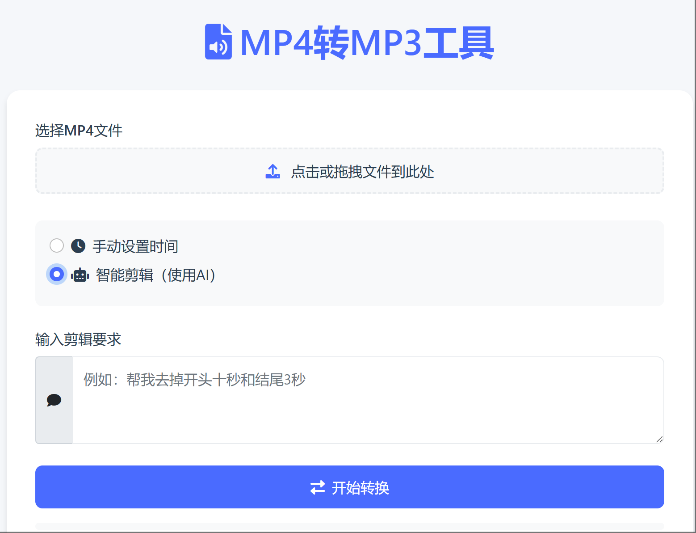

# MP4转MP3工具

一个简单易用的MP4转MP3工具，支持手动剪辑和AI智能剪辑功能。



## 功能特点

- 🎥 **MP4文件上传**：支持拖拽上传和文件选择器上传
- ✂️ **手动剪辑**：精确控制音频片段
- 🤖 **AI智能剪辑**：自动识别并提取音频片段
- 📱 **响应式设计**：适配各种设备屏幕
- ⚡ **实时进度显示**：清晰展示转换进度


## 技术栈

### 前端
- HTML5
- CSS3
- JavaScript (ES6+)
- Bootstrap 5

### 后端
- Node.js
- Express.js

### 视频处理
- FFmpeg

### AI接口
- DeepSeek API

## 安装说明

1. 克隆仓库
```bash
git clone https://github.com/Zhouyx26/MediaEditKit.git
cd MediaEditKit
```

2. 安装依赖
```bash
npm install
```

3. 安装FFmpeg
- Windows: 下载并安装 [FFmpeg](https://ffmpeg.org/download.html)
- 将FFmpeg添加到系统环境变量

4. 配置环境变量
```bash
# 创建.env文件
touch .env
# 添加以下内容
OPENAI_API_KEY=your_api_key_here
```

5. 启动服务器
```bash
node server.js
```

6. 访问应用
打开浏览器访问 `http://localhost:3000`

## 使用说明

1. 上传MP4文件
   - 拖拽文件到上传区域
   - 或点击选择文件按钮

2. 选择剪辑方式
   - 手动剪辑：拖动滑块选择片段
   - AI智能剪辑：输入提示词，AI自动识别


## 注意事项

- 确保已正确安装FFmpeg
- 文件大小限制：最大100MB
- 建议使用Chrome或Firefox浏览器

## 许可证

MIT License 